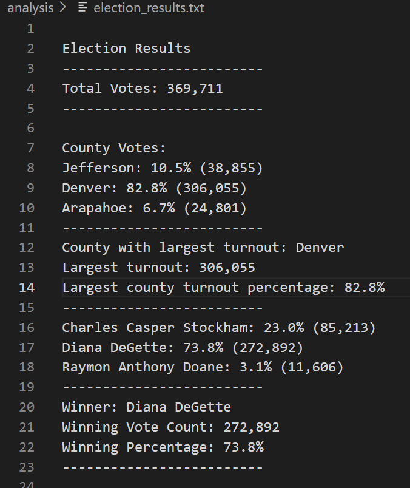

# Election_Analysis

## Overview of Election Audit
The Colorado Board of Elections has requested some data to complete the election audit
### Purpose
The goal is to use Python and retrieve data from the provided CSV file *election_results.csv* to deliver the below information requested from the election commission:

  - The voter turnout for each county
  - The percentage of votes from each county out of the total count
  - The county with the highest turnout

## Election Audit Result
Below are the election outcomes
- **Total votes** : There were **369,711** votes cast in the election.
    
### County Results

As shown below, **Denver has the largest number of votes** 

   - Jefferson: 10.5% (38,855)
   - Denver: 82.8% (306,055)
   - Arapahoe: 6.7% (24,801)
    
### Candidate Results

**The winner** of the election was **Diana DeGette** who received **73.8%** of the votes and **272,892** votes
  - Charles Casper Stockham: 23.0% (85,213)
  - Diana DeGette: 73.8% (272,892)
  - Raymon Anthony Doane: 3.1% (11,606)

:star2: **The output of the election outcomes has been calcualted with python script based on the provided data**

## Election Audit Summary
This script can be used to calculate the winner and voter turnout by county for any election. However, it might require a few modifications:

1. Instead of counting votes by county, the election commission may be interested in looking at votes by state or city. In this case, the word county will need to be changed in the print statements.

2. The code is also relying on the candidate's name and county to be in specific columns in the csv file. If these values are in different columns in future datasets, the references in the code will need to be updated.
